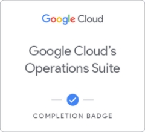
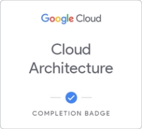
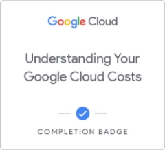
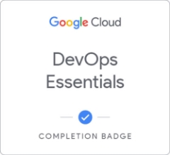
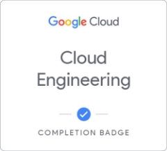
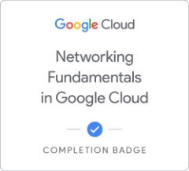
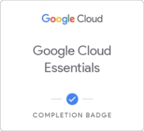
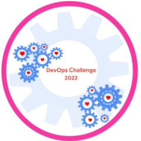
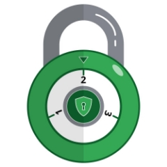

     

SUDHIR SHARMA

Member since 2022

  

Google Cloud's Operations Suite Deploy to Kubernetes in Google Cloud Build and Secure Networks in Google Cloud

Earned May 23, 2022 EDT Earned May 23, 2022 EDT Earned May 23, 2022 EDT Learn more Learn more Learn more

  

Google Cloud Solutions I: Scaling Your Infrastructure Cloud Architecture Understanding Your Google Cloud Costs

Earned May 23, 2022 EDT Earned May 22, 2022 EDT Earned May 21, 2022 EDT Learn more Learn more Learn more

  

DevOps Essentials Set Up and Configure a Cloud Environment in Google Cloud Cloud Engineering

Earned May 20, 2022 EDT Earned May 20, 2022 EDT Earned May 20, 2022 EDT Learn more Learn more Learn more

  

Kubernetes in Google Cloud Networking Fundamentals in Google Cloud Perform Foundational Infrastructure Tasks in Google Cloud

Earned May 20, 2022 EDT Earned May 19, 2022 EDT Earned May 18, 2022 EDT Learn more Learn more Learn more

  

Baseline: Infrastructure Create and Manage Cloud Resources Google Cloud Essentials

Earned May 18, 2022 EDT Earned May 18, 2022 EDT Earned May 18, 2022 EDT Learn more Learn more Learn more

 

DevOps: A beautiful relationship Learn to Earn Cloud Security Challenge: Level 2

Earned Feb 14, 2022 EST Earned Jan 27, 2022 EST Learn more Learn more
